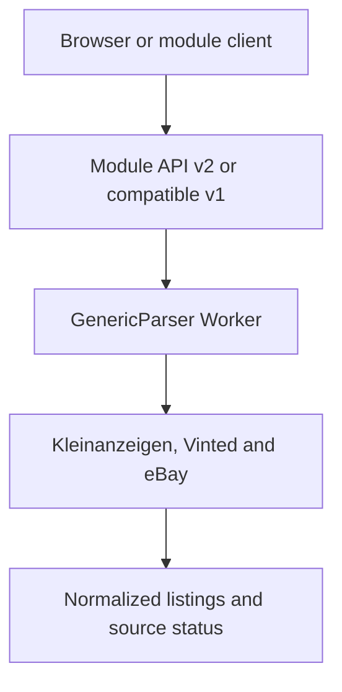

# GenericParser

Independent multi-source marketplace search and responsive browser UI for
**Kleinanzeigen**, **Vinted** and **eBay**. Existing Evercade and SNES adapters
remain optional module-v1 compatibility helpers.

## Current release

- **Version:** `2.0.0`
- **Build:** `gp-200-20260813-2`
- **Status:** Release candidate; production acceptance pending
- **Worker profile:** Cloudflare Workers Paid
- **Preferred module contract:** `generic-parser-module-v2`
- **Compatible module contract:** `generic-parser-module-v1`
- **Search runtime:** `0.45.0`
- **Functional search core:** `0.44.4`
- **Operational reference:** `0.44.6.5`

GenericParser 1.6.5 is a maintenance release without functional change. It
removes code that no longer runs, reduces the browser asset set to what the
pages actually load, and makes the release identity derivable from a single
source. Search core, marketplace adapters, classification, module-v1, module-v2
and the browser interface behave exactly as in 1.6.4.

`src/generic_parser/release_identity.py` is the only file a version bump edits.
Every other place that carries the version — `VERSION.json`, the public browser
identity, the embedded build identity, the service-worker cache name, the asset
query strings, the eBay deletion component, the OpenAPI description and this
section — is generated by `scripts/sync_release_identity.py`. The deploy gate
runs the same script with `--check` and fails on any drift.

The behavior described below is unchanged since 1.6.3, which kept the
project-independent module API v2 and the proven
three-source search core, while making long mobile packet sequences resilient.
A transient Safari `Load failed` is classified as a retryable transport
interruption and the unchanged API-v2 packet is resent with a short bounded
recovery backoff. Successful packets still have no artificial delay. Vinted
background details yield to the primary search and start when the main packet
stream pauses or finishes.

Module-v1, module-v2 schemas, signed continuation tokens, marketplace
adapters, classification, fixed-price eBay default, explicit favorites and the
signed Marketplace Account Deletion endpoint remain compatible.

The release gate includes the existing Python, marketplace and browser matrix
plus a deterministic 30-packet mobile simulation that drops packet 29 once.
The run must recover automatically with its continuation cursor and all 819
in-memory listings intact. Production workflow and live long-run evidence are
recorded only after deployment acceptance.

## Architecture



## Public endpoints

- `GET /health`
- `GET /version`
- `GET /diagnostics`
- `GET /api/module/v1/capabilities`
- `POST /api/module/v1/profile/validate`
- `POST /api/module/v1/search`
- `GET /api/module/v2/capabilities`
- `POST /api/module/v2/validate`
- `POST /api/module/v2/search`
- `POST /api/module/v2/batch`
- `POST /api/module/search`
- `POST /api/search`
- `POST /search`
- `POST /api/vinted/enrich`
- `POST /api/module/v1/vinted/enrich`
- `GET /api/module/v1/self-test?enabled=true`

eBay Marketplace Account Deletion endpoint:

- `GET/POST https://genericparser-ebay-notifications.f6yv7sgtgw.workers.dev/marketplace-account-deletion`

The two enrichment paths remain Vinted-only additive support endpoints. They accept at most three already returned Vinted listings, validate canonical item URLs, load those three detail pages in parallel and return updated listings with matching and traffic-light scoring recalculated. The bundled browser uses them automatically; module-v1 clients may use the canonical module path.

## Paid Worker profile

Free-Worker protection waits are disabled:

- new-search cooldown: `0 ms`
- normal packet delay: `0 ms`
- successful-packet delay: `0 ms`
- transport recovery only: `250`, `750`, `1,500`, `3,000`, `5,000` and `8,000 ms`
- auto-resume quiet period: effectively immediate
- recovery health interval: effectively immediate

The proven seven-result Kleinanzeigen work-packet structure remains unchanged. Vinted background work uses serial three-item batches, yields while the primary search is running and never changes its continuation state.

## Module contracts

`generic-parser-module-v2` is the preferred project-independent integration
boundary. It processes one source page per request, returns an opaque signed
continuation token until the batch is complete, and normalizes source status,
listing identity and known-total pricing. Up to 100 definitions fit in one
batch. Persistent server jobs are not part of the 1.6 line.

Example v2 request:

```json
{
  "contract": "generic-parser-module-v2",
  "batch_id": "browser-20260810-1",
  "client": {"project_id": "my-client", "project_version": "2.0.0"},
  "search": {
    "search_id": "retro-handheld",
    "query": "Retro Handheld",
    "sources": ["kleinanzeigen", "vinted", "ebay"],
    "criteria": {
      "required_terms": ["Handheld"],
      "excluded_terms": ["defekt"]
    },
    "filters": {
      "max_price": 80,
      "include_auctions": false,
      "include_review": true,
      "include_rejected": true
    },
    "location": {},
    "sort_by": "relevance"
  },
  "continuation_token": null,
  "debug": {"enabled": false}
}
```

Term arrays may also be supplied as comma-separated strings. Empty fields are
ignored. The full contract is in
[`docs/openapi-module-v2.json`](docs/openapi-module-v2.json).

`generic-parser-module-v1` remains available unchanged for existing clients
and adapters. Clients should rely on a published contract rather than pinning
an implementation filename or exact build.

## Project adapters

```python
from generic_parser import evercade_profile, snes_pal_profile

profile = evercade_profile("Interplay Collection 1", market_value=30, max_price=35)
snes = snes_pal_profile("Super Metroid", market_value=70)
```

## Diagnostics

Debug logging and network-free module self-tests remain opt-in and are disabled by default. Production diagnostics cover version/build identity, API contract, routing, CORS/preflight and endpoint availability.

## Vinted detail behavior

- Inline critical path: maximum 3 detail pages per Vinted catalog page.
- Deferred path: maximum 3 detail pages per request, parallel within the batch.
- Client queue: one deferred batch at a time.
- Detail timeout: 6 seconds per Browser Run navigation.
- Merge: image, price, description and condition update the existing card.
- Scoring: updated price and condition are re-evaluated.
- Failure model: fail-open; catalog results remain available.
- Access policy: no login, CAPTCHA, rate-limit or access-control bypass.

## eBay behavior

- Transport: official eBay Production Browse API.
- Marketplace and delivery country: `EBAY_DE` / `DE`.
- Result page size: 25.
- Fixed-price offers are enabled by default; auction-only offers require `include_ebay_auctions: true`.
- `item_price` always remains distinct from `shipping_cost` and `total_price`.
- Matching uses `price = total_price` only when shipping is known or the offer is pickup-only.
- Unknown shipping is shown as open and is never treated as free.
- OAuth tokens live only in Worker memory until expiry.
- eBay search results are not stored server-side and remain excluded from browser search-state IndexedDB persistence.
- Only a listing explicitly marked with the star is stored in the current browser. The favorite snapshot omits description, seller name, seller ID and all account data.
- Signed eBay deletion notifications are verified with eBay's public-key API; the endpoint stores no notification user data.
- OAuth/Browse failures degrade only eBay; other source results remain available.

## Browser interface

- A clear query/source/action row starts searches across one or all platforms.
- Required, excluded, spelling-variant and brand terms use removable chips
  with comma, Enter and paste input.
- Search criteria stay separate from result filters and technical options.
- Recent searches, profile preview/rename/delete and per-source progress reduce
  repeated work and make degraded sources visible.
- Active result filters are removable chips; mobile layouts collapse the full
  filter panel behind a count-labelled control.
- `Log & Diagnose` is available directly in the top header.
- The former visible technical-details expander is removed; diagnostics continue to be recorded in the dedicated log page.
- Search results use a dense responsive grid: three or more cards fit across normal desktop widths and four to five fit on wider displays.
- Every result card keeps a small square thumbnail and its text side by side, including on phone layouts.
- The decorative four-dot project mark is removed from the search-page header.
- Result cards retain source, traffic-light, condition and action regions without horizontal scrolling.
- Listing descriptions are no longer displayed, making every card shorter.
- User-facing status labels are `Passend`, `Prüfen` and `Unpassend`; the chosen
  sort applies within the unchanged internal classification groups.
- Filters cover traffic light, source, product class, condition, total price, shipping, scope and offer format. Red results are hidden by default but remain selectable.
- Manual stops are labelled as paused and resumable, never as fully completed.
- Result filters use two balanced desktop rows and responsive three-, two- and one-column layouts at narrower widths.
- The star in the upper-right corner saves an explicit favorite; `/favorites.html` lists and filters saved offers.
- The decorative project mark is removed from both search and log headers.

## Release quality gate

A stable release requires:

1. syntax and compile checks;
2. search-core regression tests;
3. module-v1 compatibility and module-v2 contract/continuation checks;
4. Cloudflare deployment;
5. live `/health`, `/version`, `/diagnostics` validation;
6. browser CORS/preflight validation;
7. live module-v2 capability and continuation packets;
8. live legacy `/api/search` packet;
9. live three-source packet with official eBay transport and fixed-price default;
10. eBay known-shipping total-price validation;
11. live deferred Vinted detail batch without catalog-path regression;
12. classification regression against known game/merchandise examples;
13. eBay deletion challenge and signed-notification verification;
14. responsive browser checks without horizontal overflow;
15. exact-source ZIP artifact and SHA-256 companion.

## Versioning

From 1.0 onward GenericParser uses semantic versioning. Search-core changes are
explicit functional changes; infrastructure and UI changes must not silently
change extraction or pagination. 1.6.0 adds module-v2 and the browser client;
1.6.1 corrects its runtime state forwarding while keeping module-v1 and the
marketplace core compatible.

Further documentation: [`ROADMAP.md`](ROADMAP.md), [`CHANGELOG.md`](CHANGELOG.md), [`VERSION.json`](VERSION.json), [`docs/API_1.6.0.md`](docs/API_1.6.0.md), [`docs/openapi-module-v2.json`](docs/openapi-module-v2.json), [`docs/RELEASE_INDEX.md`](docs/RELEASE_INDEX.md) and [`docs/releases/1.6.5.md`](docs/releases/1.6.5.md).
